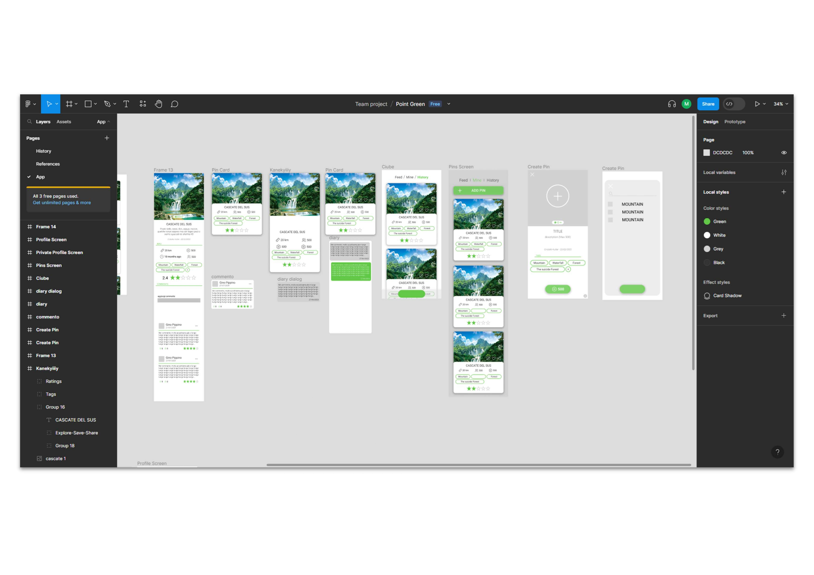

## Intro
- parte del progetto Point Green
- altri partecipanti: Domenico Giubellini, Ruben Cuttica, Tommaso Giachetto, Pietro Sapia
- app mobile scritta in React Native
- il progetto è un prototipo di UI, non presenta un backend 

## Idea
- creare un'app che permette la condivisione di luoghi naturali in un social gamificato
- un'unione tra Instagram e Pokemon Go

## Immagini

